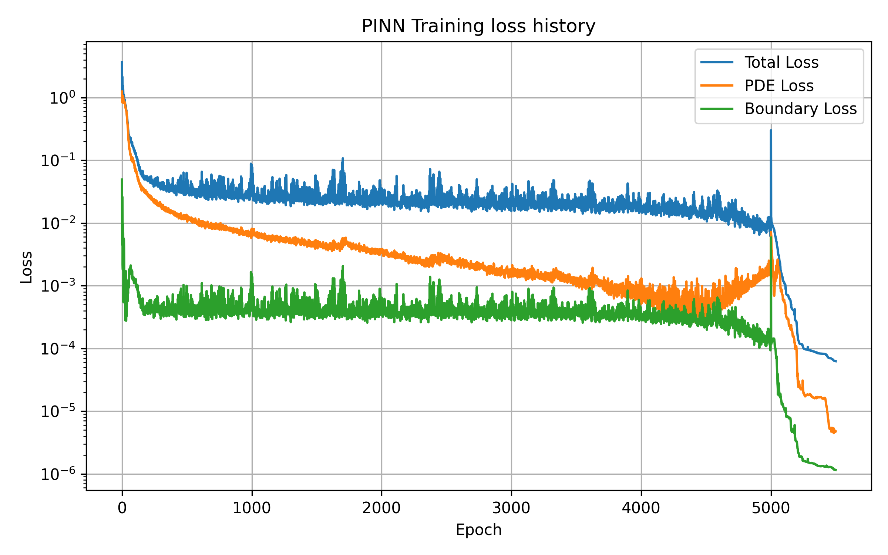

# GenAI Simulation Assistant for FEM and PINN Workflows

This project implements a **GenAI-powered simulation assistant** that
allows users to run engineering simulations using natural language
commands.

------------------------------------------------------------------------

# Motivation

Engineering simulations are often executed through repetitive scripts
and manual configuration. This project demonstrates how **Generative
AI** can automate simulation workflows while maintaining numerical
correctness and reproducibility.

------------------------------------------------------------------------

# System Overview

User Command → LLM Parser → Simulation Runner → FEM / PINN Solver → Plot
/ Report → Stored Results

------------------------------------------------------------------------

# Example Commands

``` text
run a 50x50 fem simulation
run a 60x60 fem simulation and compare dense vs sparse
execute a pinn simulation on 40x40 with epochs=4000 and hidden_dim=64
simulate a fem with 50x50 and generate plot and report.
```

------------------------------------------------------------------------

# Example Outputs

## FEM Solution


## Runtime Comparison


## PINN Loss History



------------------------------------------------------------------------

# Project Structure

``` text
GenAi_simulation_assistant/
│
├── src/
│   ├── api/
│   ├── parsing/
│   ├── runners/
│   ├── reporting/
│   └── config/
    └── utils/
│
├── outputs/
│   ├── runs/
│   ├── checkpoints/
│   └── figures/
│
├── Dockerfile
├── requirements.txt
├── README.md
└── .github/
    └── workflows/
        └── ci.yml
│
├── render.yaml
```

------------------------------------------------------------------------

## Deployment

This project is deployed as a live cloud service using automated
Continuous Integration (CI) and Continuous Deployment (CD).

Every push to the `main` branch:

-   runs automated checks
-   builds a Docker image
-   deploys the service to the cloud

------------------------------------------------------------------------

## Live Cloud Demo

Base URL:

https://genai-simulation-assistant.onrender.com

Interactive API documentation:

https://genai-simulation-assistant.onrender.com/docs

Example request:

``` bash
curl -X POST https://genai-simulation-assistant.onrender.com/run-simulation -H "Content-Type: application/json" -d '{
  "command": "run a fem simulation with 20x20"
}'
```

------------------------------------------------------------------------

## Continuous Integration (CI)

This project uses GitHub Actions to automatically validate the codebase.

The CI pipeline performs:

-   dependency installation
-   Python syntax checks
-   linting
-   Docker image build verification

------------------------------------------------------------------------

## Continuous Deployment (CD)

Deployment workflow:

Developer Push\
↓\
GitHub Actions\
↓\
Docker Build\
↓\
Render Cloud Deployment\
↓\
Live API Service

------------------------------------------------------------------------
